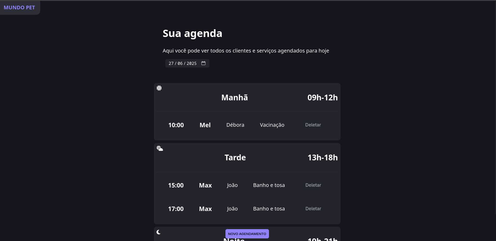
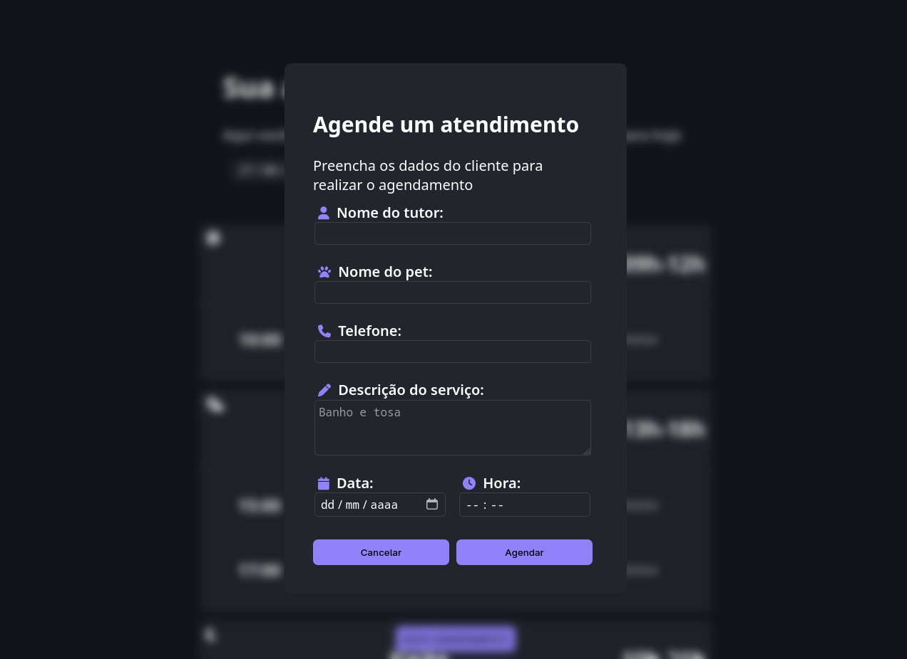

# Agendamento Pet Shop
Aplicação de agendamento de atendimentos para Pet Shop, desenvolvida com HTML, CSS, JavaScript e Day.js. O projeto permite organizar e visualizar os agendamentos de forma prática, separando os horários por períodos do dia.

## Objetivo do Projeto

Esse projeto foi desenvolvido com o intuito de praticar conceitos de:

- Manipulação de DOM

- Organização de código em JavaScript puro

- Consumo de dados via API fake (json-server)

- Uso de bibliotecas externas como Day.js

- Estruturação de uma aplicação completa (front-end + simulação de back-end)


## Funcionalidades

- Cadastro de novos agendamentos

- Visualização de agendamentos por período da manhã, tarde e noite.

- Edição e exclusão de agendamentos

- Integração com json-server para simular um backend

- Manipulação de datas com Day.js

- Layout simples e responsivo


## Tecnologias Utilizadas

- HTML5
- CSS3
- JavaScript Vanilla
- Day.js
- JSON Server (backend simulado para testes)


## Como Executar o Projeto

Clone o repositório:

```bash 
git clone https://github.com/seu-usuario/nome-do-repositorio.git
```

Instale o json-server globalmente se ainda não tiver:

```bash
npm install -g json-server
```

Inicie o servidor:

```bash
json-server --watch db.json
```

Abra o arquivo index.html no navegador.

## Design


